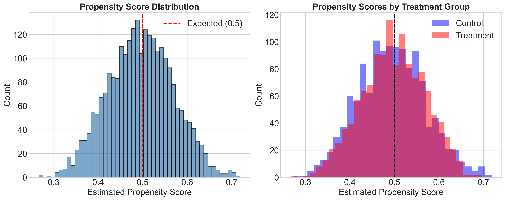

# Machine Learning
## Propensity Scores

First, we analyse the propensity score. This is important because, in a perfectly randomised experiment (such as flipping a fair coin), everyone should have a 50% chance of receiving the treatment. The propensity score helps us to check whether our randomisation was successful. As can be seen in the graph on the left (Propensity Score Distribution), most people have propensity scores clustered around 0.5 (the red dashed line), which is exactly what we would expect in a well-randomised experiment. The bell-shaped distribution centred at 0.5 is a good sign; it means the randomisation worked well. The graph on the right (Scores by Treatment Group) shows that the distributions of propensity scores for both the treatment group (red) and the control group (blue) are similar. The substantial purple overlap area is good because it means the two groups are comparable. If the distributions were very different, it would suggest that the randomisation had failed.

## Cross-Validation and Tuning

After validating our randomisation process using propensity score analysis, we investigated whether the financial information intervention had an equal impact on all participants or if it produced different effects on different subgroups. We used causal forest analysis to identify these heterogeneous treatment effects. Causal forests are an advanced machine learning technique that extends random forests for causal inference.

Unlike traditional methods, which estimate only average treatment effects, causal forests automatically discover subgroups of participants with different responses to interventions. In our context, this involved identifying demographic or behavioural characteristics that predicted stronger or weaker responses to the ETF information, without specifying which factors might matter beforehand.

To optimise model performance, we conducted systematic hyperparameter tuning, testing nine configurations that varied the minimum observations per leaf (5 to 50), the number of trees (2,000 to 4,000), the sampling proportion (45% to 50%), and the feature selection methods. To ensure robust results, we implemented five-fold cross-validation with stratification. Our evaluation framework balanced two objectives through a composite scoring function: detecting meaningful heterogeneity (weighted at 40%) and maintaining statistical precision (60%). This approach prioritised reliable estimates while capturing important variation in treatment responses.

The analysis yielded compelling findings. The average treatment effect remained remarkably stable at approximately 17.9 percentage points across all configurations. The optimal configuration consisted of 20 samples per leaf, 4,000 trees and a 45% sampling rate.

## Heterogeneity Analysis

Having established the optimal causal forest configuration, we conducted a heterogeneity analysis to understand the influence of the provided financial information on different participants.

A histogram displaying the distribution of individualised treatment effects is shown on the left.  This distribution is approximately normal, centred around an average effect of 17.9 percentage points. This bell curve indicates that most participants' responses cluster around the average, with fewer individuals showing extremely high or low responses.

The plot on the right shows how the treatment effect varied across the whole population. It reveals substantial heterogeneity in individual responses. The blue line represents the point estimates, ranging from approximately 8 to 27 percentage points. In other words, some participants responded nearly three times more strongly to the treatment than others did. The pink shaded area shows the 95% confidence intervals, which remain consistently above zero and narrow.

## Features of Importance

We identify the participant characteristics that drive the heterogeneous treatment effects that we discovered. The causal forest algorithm automatically determines which variables best explain why some individuals responded more strongly to the ETF information than others. By extracting feature importances from our optimised model, we can identify the key factors that influence the effectiveness of the intervention.

The results reveal a clear hierarchy of influence. Subjective financial knowledge emerges as the dominant driver, explaining 22.5% of the variation in treatment response. This suggests that participants' self-perceived understanding of financial knowledge fundamentally shapes how they process and act on new financial information. Risk tolerance is the second most important factor, accounting for 13.9% of the variation in treatment response. Age contributes 13.1%, potentially reflecting generational differences in investment attitudes or retirement planning horizons.

The cumulative importance plot shows that the seven most important variables account for almost 80% of the treatment effect heterogeneity, while the remaining variables contribute only marginally. These seven variables are subjective financial knowledge, risk tolerance, age, trust in government, social origin, political placement and education.

## Heterogneity Analysis by Features of Importance
 
We extract the individual treatment effects directly from the top four variables that explained the most percentage of the heterogeneity. These are  subjective financial knowledge, age, riskt tolerance, trust in government. Age shows a positive relationship with treatment effects, rising from about 16 percentage points for younger participants to over 20 percentage points for those in their mid sixties and older. This suggests that proximity to retirement may increase receptiveness to investment information. On the other hand, subjective financial knowledge displays a negative relationship, with those rating themselves as highly knowledgeable showing treatment effects near 12 percentage points compared to 23 percentage points for those with low self-rated knowledge. This finding suggests that financial information may be most valuable for those who recognize their knowledge gaps. 

There is a negative relationship between risk tolerance and the treatment effect. This suggests that risk-averse individuals respond more strongly to financial information. It is not surprising that individuals with lower risk tolerance respond better to financial information. Many individuals do not know much about ETFs; once they were given information about the short-term and long-term risks of ETFs compared with other investment instruments, they opted to invest more in ETFs. Finally, we found that people who trust the government less responded better to the treatment.

## Policy Tree Decision 

We estimated the heterogeneous effects using a causal forest of 4,000 trees. While this ensemble is highly accurate, it is difficult to interpret. It's like thousands of experts voting: you see the outcome, but not the reasoning behind it. To reveal the underlying logic, we created a compact 'policy tree' that was trained to mimic the forest's predictions. This translates the model into clear if-then rules about who benefits more. While it cannot capture every nuance of the full forest, it does highlight the features most associated with larger treatment effects.

In the visualisation, darker nodes represent a higher treatment effect. The root node represents the full sample (100%) with an average treatment effect of 17.9 percentage points. From there, the tree splits based on key characteristics in order to identify subgroups that respond most strongly to the intervention. The primary split is subjective financial knowledge at a threshold of 6.5. The left branch (score <6.5) covers 70.1% of participants and shows an average treatment effect of 19.8 percentage points. The right branch (score >6.5) covers 29.9% of participants and shows an average treatment effect of 13.5 percentage points. This pattern suggests that respondents with lower financial knowledge benefit more from the treatment.

Among respondents with low subjective financial knowledge (score <6.5), the tree splits further. First, it splits the group at 4.5, yielding two branches: 'very low knowledge' (score <4.5) and 'moderately low' (score 4.5–6.5). The branch representing very low knowledge shows a larger average treatment effect (ATE) of 22.0 percentage points, compared with 18.0 points for the branch representing moderately low knowledge. At the next level (depth 3), the branches are divided by different factors: one splits based on social origin and the other based on age. Along the social origin split, participants from lower socioeconomic backgrounds exhibit a stronger effect. Their effect is 23.0 percentage points, versus 20.4 percentage points for those from higher-status backgrounds. Along the age split, the effect is 21.3 percentage points among those aged over 62, compared with 17.4 percentage points among younger respondents. The findings suggest that the effects are strongest within the low-knowledge segment for individuals with very low knowledge, from lower socioeconomic backgrounds, and older adults.

Among respondents with high subjective financial knowledge (score >6.5), the tree splits next on social origin. Individuals from higher socioeconomic backgrounds demonstrate an ATE of 11.9 percentage points, whereas their counterparts from lower socioeconomic backgrounds demonstrate a larger ATE of 15.9 percentage points. The algorithm then splits on risk tolerance, with different cutoffs by social origin: 6.5 for individuals from higher-SES backgrounds and 5.5 for individuals from lower-SES backgrounds. Within the higher-SES branch, those with lower risk tolerance (≤6.5) have an ATE of 14.0, compared to 10.9 for their higher-risk-tolerance peers. Within the lower-SES branch, those with lower risk tolerance (≤5.5) reach an ATE of 17.7 points versus 15.0 points for those with higher risk tolerance. This tree suggests that, among respondents with high financial knowledge, the effects are consistently stronger for those from lower socioeconomic backgrounds and for those with lower risk tolerance.

